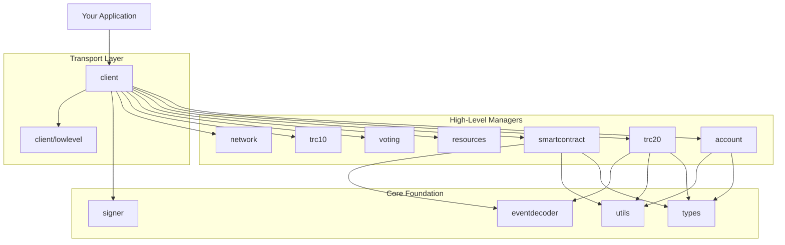
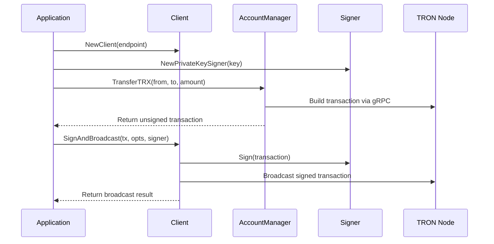
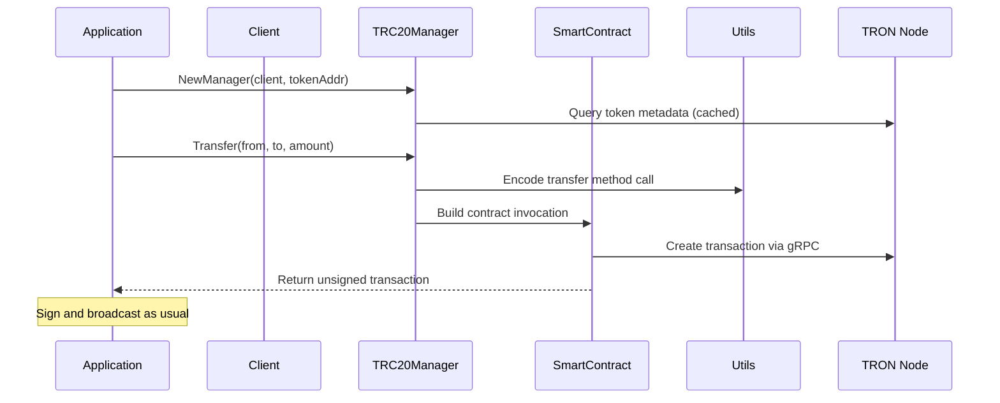
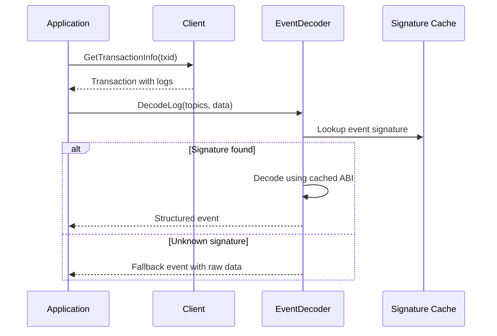

# 🏗️ TronLib Architecture

This document provides a comprehensive overview of TronLib's architecture, design principles, and component interactions.

## 🎯 Design Principles

### 1. **High-Level Abstractions** 🚀
TronLib prioritizes developer experience by providing high-level, domain-specific APIs that abstract away blockchain complexity while maintaining access to lower-level functionality when needed.

### 2. **Modular Architecture** 🧩
Each package has a single responsibility and well-defined interfaces, making the library easy to understand, test, and extend.

### 3. **Type Safety** 🔒
Strong typing throughout the library prevents common errors, especially around address handling and numeric conversions.

### 4. **Performance** ⚡
Connection pooling, caching of immutable data, and efficient gRPC communication ensure optimal performance.

## 📋 Component Overview



## 🔧 Core Components

### 🌐 Client Package (`pkg/client`)

**Role**: Central communication hub with TRON nodes

**Key Features**:
- gRPC connection management with pooling
- Automatic retry and timeout handling
- Transaction signing and broadcasting
- Simulation capabilities
- Manager factory methods

**Connection Management**:
```go
// Connection pool configuration
cli, err := client.NewClient("grpc://grpc.trongrid.io:50051",
    client.WithPool(5, 10),           // 5 initial, 10 max connections
    client.WithTimeout(30*time.Second)) // Default timeout
```

**Manager Access Pattern**:
```go
accountMgr := cli.Accounts()          // Account operations
trc20Mgr, _ := cli.TRC20(tokenAddr)   // TRC20 operations
contractMgr := cli.SmartContracts()   // Contract operations
```

### 🏷️ Types Package (`pkg/types`)

**Role**: Fundamental types and constants

**Core Types**:
- `Address`: Multi-format address handling (Base58, hex, EVM)
- `Transaction`: Transaction wrapper with extensions
- Error types and constants

**Address Handling**:
```go
// Flexible address creation
addr1, _ := types.NewAddress("TxxxBase58Address")           // Base58
addr2, _ := types.NewAddressFromHex("41xxxxxxxxxxxxxxxx")   // TRON hex
addr3, _ := types.NewAddressFromBytes(addressBytes)        // Raw bytes

// Multiple output formats
base58 := addr.String()        // Base58 (default)
tronHex := addr.Hex()         // 41-prefixed hex
evmHex := addr.HexEVM()       // 0x-prefixed hex
bytes := addr.Bytes()         // 21-byte slice
```

### 🔐 Signer Package (`pkg/signer`)

**Role**: Key management and transaction signing

**Signing Methods**:
- Private key signing
- HD wallet derivation
- Multiple key format support

```go
// Private key signer
signer, _ := signer.NewPrivateKeySigner("hex-private-key")

// HD wallet derivation
wallet, _ := signer.NewHDWallet("twelve word mnemonic phrase")
account, _ := wallet.DerivePath("m/44'/195'/0'/0/0")
```

### 🛠️ Utils Package (`pkg/utils`)

**Role**: ABI encoding/decoding and type conversion utilities

**Core Functionality**:
- ABI method encoding
- Event signature generation
- Type marshaling/unmarshaling
- Data validation

```go
// ABI processing
processor := utils.NewABIProcessor(abiObject)
encoded, _ := processor.EncodeMethod("transfer", 
    []string{"address", "uint256"}, 
    recipient, amount)
```

## 🎯 High-Level Managers

### 💰 Account Manager (`pkg/account`)

**Purpose**: Account operations and TRX transfers

**Key Operations**:
- Balance queries
- Account information retrieval
- TRX transfers
- Account resource management

```go
am := client.Accounts()

// Query operations
balance, _ := am.GetBalance(ctx, address)
account, _ := am.GetAccount(ctx, address)

// Transfer operations
tx, _ := am.TransferTRX(ctx, from, to, amount)
```

### 🪙 TRC20 Manager (`pkg/trc20`)

**Purpose**: TRC20 token operations with decimal handling

**Key Features**:
- Automatic decimal conversion
- Immutable property caching (name, symbol, decimals)
- Standard TRC20 operations
- Precision arithmetic using `shopspring/decimal`

```go
trc20Mgr, _ := trc20.NewManager(client, tokenAddress)

// Cached properties (fetched once)
name, _ := trc20Mgr.Name(ctx)
symbol, _ := trc20Mgr.Symbol(ctx) 
decimals, _ := trc20Mgr.Decimals(ctx)

// Operations with decimal precision
amount := decimal.NewFromFloat(12.34)
_, tx, _ := trc20Mgr.Transfer(ctx, from, to, amount)
```

### 📜 Smart Contract Manager (`pkg/smartcontract`)

**Purpose**: Contract deployment and interaction

**Two-Level API**:
1. **Manager**: Deployment and administrative operations
2. **Instance**: Bound contract interaction

```go
// Manager for deployment
mgr := client.SmartContracts()
contractAddr, _ := mgr.Deploy(ctx, owner, "MyContract", abi, bytecode, value, feeLimit, consumeUserResourcePercent, constructorParams...)

// Instance for interaction  
instance, _ := smartcontract.NewInstance(client, contractAddr, abi)
tx, _ := instance.Invoke(ctx, caller, value, "methodName", param1, param2)
```

### 🎭 Event Decoder (`pkg/eventdecoder`)

**Purpose**: Transaction log decoding with built-in event support

**Key Features**:
- Built-in TRC20 event signatures
- Runtime ABI registration
- Structured event output
- Graceful fallback for unknown events

```go
// Built-in TRC20 events work automatically
event, _ := eventdecoder.DecodeLog(topics, data)

// Register custom events
eventdecoder.RegisterABIJSON(customABI)

// Structured output
fmt.Printf("Event: %s\n", event.EventName)
for _, param := range event.Parameters {
    fmt.Printf("  %s (%s): %v\n", param.Name, param.Type, param.Value)
}
```

## 🔄 Typical Workflows

### 1. Simple TRX Transfer Flow



### 2. TRC20 Transfer Flow



### 3. Event Decoding Flow



## 🔧 Configuration and Customization

### Client Configuration

```go
cli, err := client.NewClient(endpoint,
    // Connection pool settings
    client.WithPool(initialConns, maxConns),
    
    // Default timeout for operations
    client.WithTimeout(duration),
    
    // Custom gRPC dial options
    client.WithDialOptions(grpc.WithKeepaliveParams(...)),
)
```

### Broadcast Options

```go
opts := client.DefaultBroadcastOptions()
opts.FeeLimit = 100_000_000              // Maximum energy cost in SUN
opts.WaitForReceipt = true               // Wait for on-chain confirmation
opts.WaitTimeout = 20 * time.Second      // Receipt wait timeout
opts.PollInterval = 500 * time.Millisecond // Polling frequency
```

### Event Decoder Customization

```go
// Register custom contract ABIs
eventdecoder.RegisterABIJSON(abiJSON)
eventdecoder.RegisterABIObject(abiObject)

// Built-in events (automatically available):
// - Transfer(address,address,uint256)
// - Approval(address,address,uint256)
```

## 🚀 Performance Considerations

### Connection Pooling
- Client maintains a pool of gRPC connections
- Pool size configurable based on application needs
- Automatic connection management and health checking

### Caching Strategy
- **TRC20 Manager**: Caches immutable properties (name, symbol, decimals)
- **Event Decoder**: Caches event signatures and ABI fragments
- **Address Types**: Lazy conversion between formats

### Decimal Precision
- Uses `shopspring/decimal` for precise arithmetic
- Automatic conversion between human-readable and on-chain formats
- Prevents floating-point precision issues common in financial applications

## 🔒 Security Best Practices

### Key Management
```go
// ✅ Good: Store keys securely
key := os.Getenv("PRIVATE_KEY")  // From environment
signer, _ := signer.NewPrivateKeySigner(key)

// ❌ Bad: Hardcode keys in source
signer, _ := signer.NewPrivateKeySigner("abc123...")
```

### Transaction Validation
```go
// ✅ Good: Simulate before broadcasting
simResult, _ := client.Simulate(ctx, tx)
if simResult.Success {
    result, _ := client.SignAndBroadcast(ctx, tx, opts, signer)
}

// ✅ Good: Set appropriate fee limits
opts.FeeLimit = 50_000_000  // Reasonable limit for TRC20 transfer
```

### Address Validation
```go
// ✅ Good: Validate addresses
addr, err := types.NewAddress(addressString)
if err != nil {
    return fmt.Errorf("invalid address: %w", err)
}

// ✅ Good: Use typed addresses throughout
func transfer(from, to *types.Address, amount decimal.Decimal) error {
    // ...
}
```

## 🔄 Extension Points

### Custom Managers
Create custom managers following the established patterns:

```go
type CustomManager struct {
    client client.Client
}

func NewCustomManager(cli client.Client) *CustomManager {
    return &CustomManager{client: cli}
}

func (m *CustomManager) CustomOperation(ctx context.Context, params...) error {
    // Use client.lowlevel or other packages as needed
}
```

### Custom Event Decoders
Extend event decoding capabilities:

```go
// Register custom ABI at startup
func init() {
    eventdecoder.RegisterABIJSON(myContractABI)
}
```

This architecture enables TronLib to provide both simplicity for common use cases and flexibility for advanced scenarios, while maintaining high performance and type safety throughout the stack.
