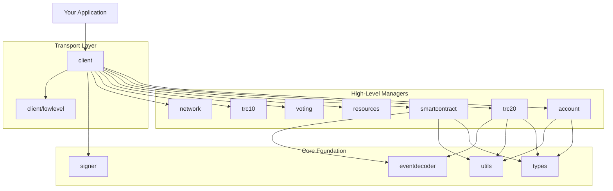
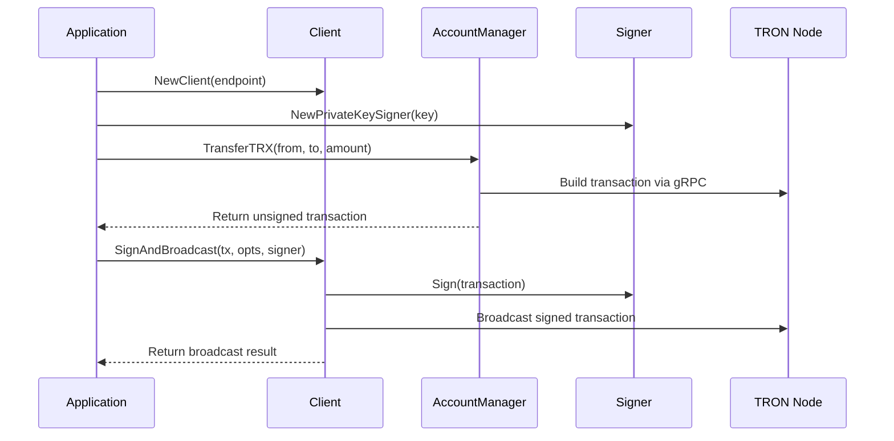
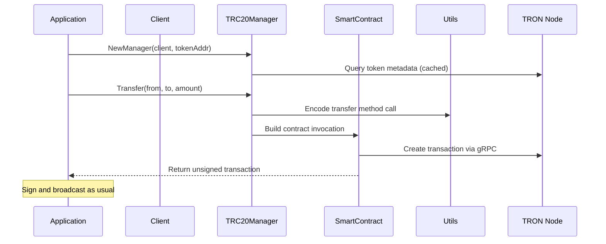
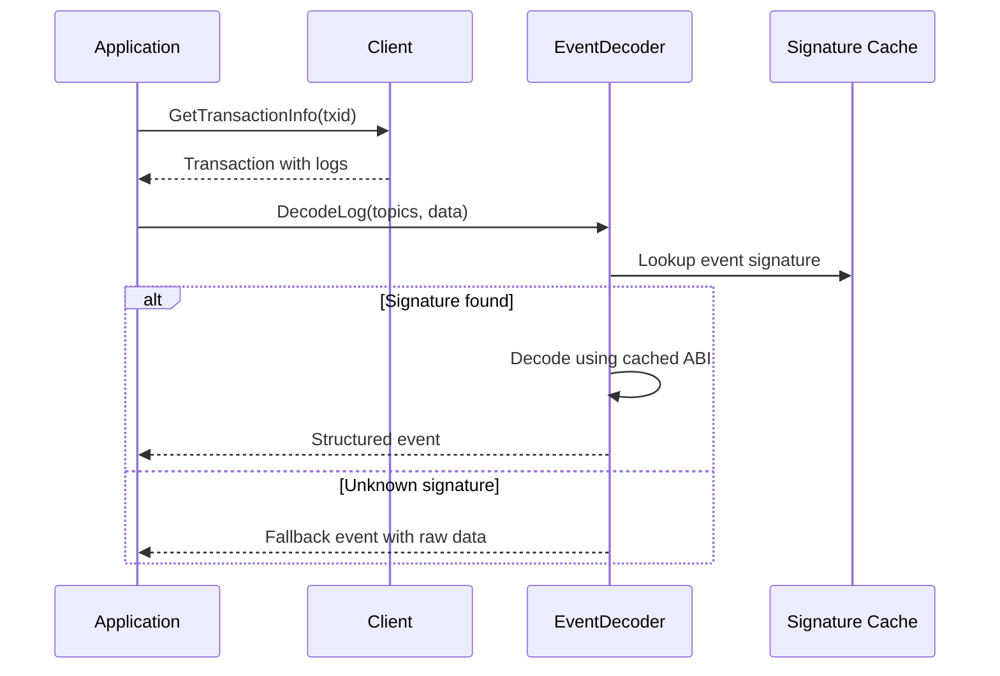
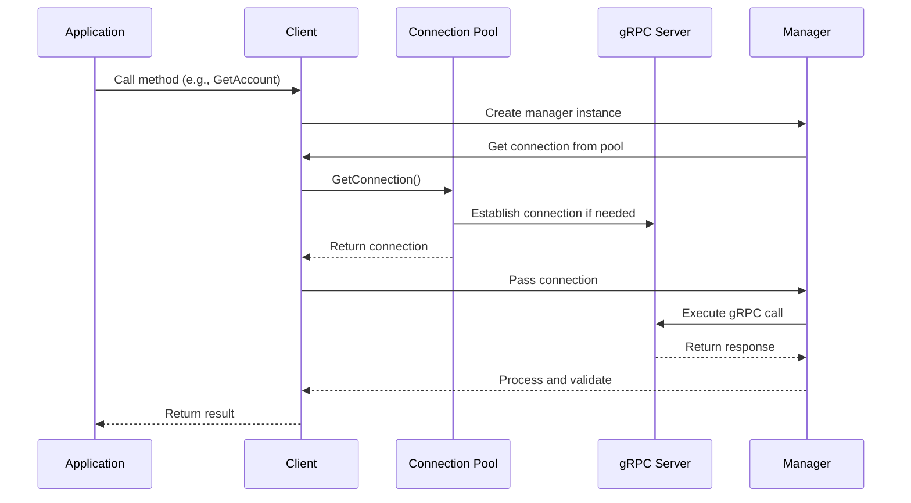
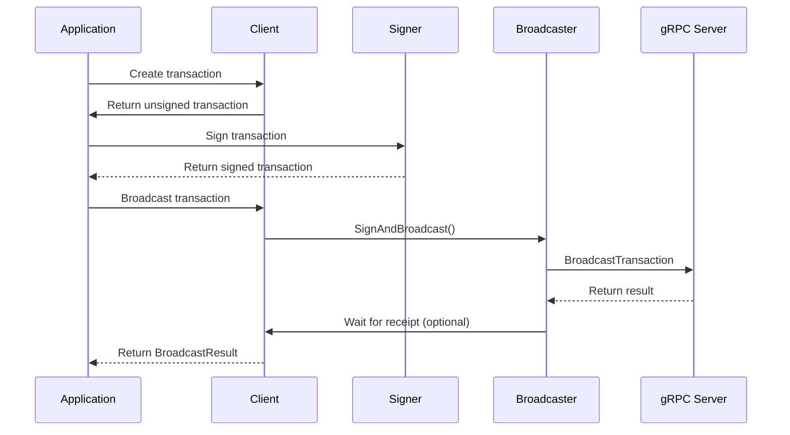
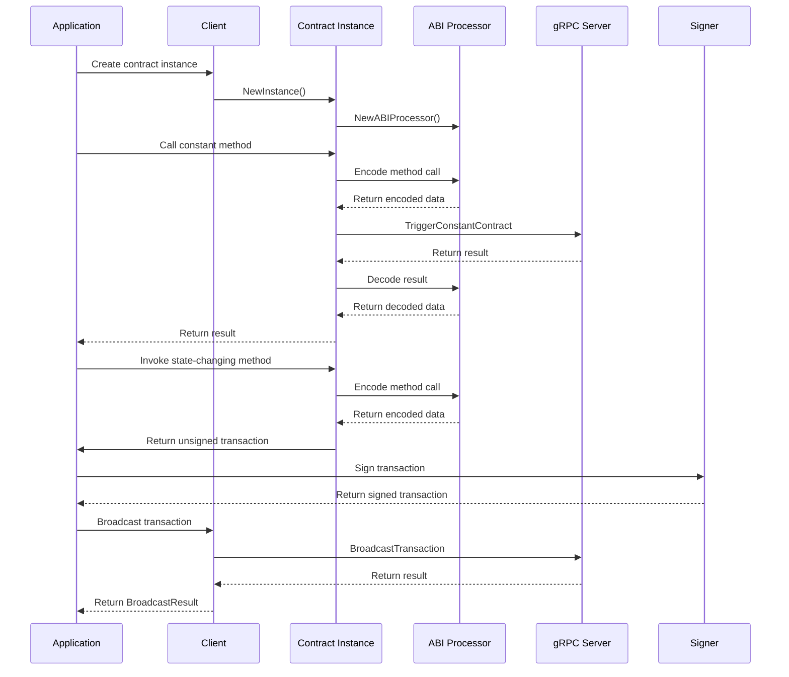

# 🏗️ TronLib Architecture

This document provides a comprehensive overview of TronLib's architecture, design principles, and component interactions. It's designed to be read after completing the [Quick Start Guide](quickstart.md) and serves as a deep dive into how the library is structured.

## 📚 Learning Path

1. [Quick Start Guide](quickstart.md) - Basic usage
2. **Architecture Overview** (this document) - Understanding the design
3. [Package Documentation](../README.md#package-references) - Detailed API references
4. [API Reference](API_REFERENCE.md) - Complete function documentation
5. [Examples](../example/) - Real-world implementations

## 🎯 Design Principles

### 1. **High-Level Abstractions** 🚀
TronLib prioritizes developer experience by providing high-level, domain-specific APIs that abstract away blockchain complexity while maintaining access to lower-level functionality when needed.

### 2. **Modular Architecture** 🧩
Each package has a single responsibility and well-defined interfaces, making the library easy to understand, test, and extend.

### 3. **Type Safety** 🔒
Strong typing throughout the library prevents common errors, especially around address handling and numeric conversions.

### 4. **Performance** ⚡
Connection pooling, caching of immutable data, and efficient gRPC communication ensure optimal performance.

## 📋 Component Overview



## 🔧 Core Components

### 🌐 Client Package (`pkg/client`)

**Role**: Central communication hub with TRON nodes

**Key Features**:
- gRPC connection management with pooling
- Automatic retry and timeout handling
- Transaction signing and broadcasting
- Simulation capabilities
- Manager factory methods

**Connection Management**:
```go
// Connection pool configuration
cli, err := client.NewClient("grpc://grpc.trongrid.io:50051",
    client.WithPool(5, 10),           // 5 initial, 10 max connections
    client.WithTimeout(30*time.Second)) // Default timeout
```

**Manager Access Pattern**:
```go
accountMgr := cli.Account()          // Account operations
trc20Mgr, _ := cli.TRC20(tokenAddr)   // TRC20 operations
contractMgr := cli.SmartContract()   // Contract operations
```

### 🏷️ Types Package (`pkg/types`)

**Role**: Fundamental types and constants

**Core Types**:
- `Address`: Multi-format address handling (Base58, hex, EVM)
- `Transaction`: Transaction wrapper with extensions
- Error types and constants

**Address Handling**:
```go
// Flexible address creation
addr1, _ := types.NewAddress("TxxxBase58Address")           // Base58
addr2, _ := types.NewAddressFromHex("41xxxxxxxxxxxxxxxx")   // TRON hex
addr3, _ := types.NewAddressFromBytes(addressBytes)        // Raw bytes

// Multiple output formats
base58 := addr.String()        // Base58 (default)
tronHex := addr.Hex()         // 41-prefixed hex
evmHex := addr.HexEVM()       // 0x-prefixed hex
bytes := addr.Bytes()         // 21-byte slice
```

### 🔐 Signer Package (`pkg/signer`)

**Role**: Key management and transaction signing

**Signing Methods**:
- Private key signing
- Multiple key format support

```go
// Private key signer
signer, _ := signer.NewPrivateKeySigner("hex-private-key")
```

### 🛠️ Utils Package (`pkg/utils`)

**Role**: ABI encoding/decoding and type conversion utilities

**Core Functionality**:
- ABI method encoding
- Event signature generation
- Type marshaling/unmarshaling
- Data validation

```go
// ABI processing
processor := utils.NewABIProcessor(abiObject)
encoded, _ := processor.EncodeMethod("transfer", 
    []string{"address", "uint256"}, 
    recipient, amount)
```

## 🎯 High-Level Managers

### 💰 Account Manager (`pkg/account`)

**Purpose**: Account operations and TRX transfers

**Key Operations**:
- Balance queries
- Account information retrieval
- TRX transfers
- Account resource management

```go
am := client.Account()

// Query operations
balance, _ := am.GetBalance(ctx, address)
account, _ := am.GetAccount(ctx, address)

// Transfer operations
tx, _ := am.TransferTRX(ctx, from, to, amount)
```

### 🪙 TRC20 Manager (`pkg/trc20`)

**Purpose**: TRC20 token operations with decimal handling

**Key Features**:
- Automatic decimal conversion
- Immutable property caching (name, symbol, decimals)
- Standard TRC20 operations
- Precision arithmetic using `shopspring/decimal`

```go
trc20Mgr, _ := trc20.NewManager(client, tokenAddress)

// Cached properties (fetched once)
name, _ := trc20Mgr.Name(ctx)
symbol, _ := trc20Mgr.Symbol(ctx) 
decimals, _ := trc20Mgr.Decimals(ctx)

// Operations with decimal precision
amount := decimal.NewFromFloat(12.34)
_, tx, _ := trc20Mgr.Transfer(ctx, from, to, amount)
```

### 📜 Smart Contract Manager (`pkg/smartcontract`)

**Purpose**: Contract deployment and interaction

**Two-Level API**:
1. **Manager**: Deployment and administrative operations
2. **Instance**: Bound contract interaction

```go
// Manager for deployment
mgr := client.SmartContracts()
contractAddr, _ := mgr.Deploy(ctx, owner, "MyContract", abi, bytecode, value, feeLimit, consumeUserResourcePercent, constructorParams...)

// Instance for interaction  
instance, _ := smartcontract.NewInstance(client, contractAddr, abi)
tx, _ := instance.Invoke(ctx, caller, value, "methodName", param1, param2)
```

### 🎭 Event Decoder (`pkg/eventdecoder`)

**Purpose**: Transaction log decoding with built-in event support

**Key Features**:
- Built-in TRC20 event signatures
- Runtime ABI registration
- Structured event output
- Graceful fallback for unknown events

```go
// Built-in TRC20 events work automatically
event, _ := eventdecoder.DecodeLog(topics, data)

// Register custom events
eventdecoder.RegisterABIJSON(customABI)

// Structured output
fmt.Printf("Event: %s\n", event.EventName)
for _, param := range event.Parameters {
    fmt.Printf("  %s (%s): %v\n", param.Name, param.Type, param.Value)
}
```

## 🔄 Typical Workflows

### 1. Simple TRX Transfer Flow



### 2. TRC20 Transfer Flow



### 3. Event Decoding Flow



## 🔧 Configuration and Customization

### Client Configuration

```go
cli, err := client.NewClient(endpoint,
    // Connection pool settings
    client.WithPool(initialConns, maxConns),
    
    // Default timeout for operations
    client.WithTimeout(duration),
    
    // Custom gRPC dial options
    client.WithDialOptions(grpc.WithKeepaliveParams(...)),
)
```

### Broadcast Options

```go
opts := client.DefaultBroadcastOptions()
opts.FeeLimit = 100_000_000              // Maximum energy cost in SUN
opts.WaitForReceipt = true               // Wait for on-chain confirmation
opts.WaitTimeout = 20 * time.Second      // Receipt wait timeout
opts.PollInterval = 500 * time.Millisecond // Polling frequency
```

### Event Decoder Customization

```go
// Register custom contract ABIs
eventdecoder.RegisterABIJSON(abiJSON)
eventdecoder.RegisterABIObject(abiObject)

// Built-in events (automatically available):
// - Transfer(address,address,uint256)
// - Approval(address,address,uint256)
```

## 🚀 Performance Considerations

### Connection Pooling
- Client maintains a pool of gRPC connections
- Pool size configurable based on application needs
- Automatic connection management and health checking

### Caching Strategy
- **TRC20 Manager**: Caches immutable properties (name, symbol, decimals)
- **Event Decoder**: Caches event signatures and ABI fragments
- **Address Types**: Lazy conversion between formats

### Decimal Precision
- Uses `shopspring/decimal` for precise arithmetic
- Automatic conversion between human-readable and on-chain formats
- Prevents floating-point precision issues common in financial applications

## 🔒 Security Best Practices

### Key Management
```go
// ✅ Good: Store keys securely
key := os.Getenv("PRIVATE_KEY")  // From environment
signer, _ := signer.NewPrivateKeySigner(key)

// ❌ Bad: Hardcode keys in source
signer, _ := signer.NewPrivateKeySigner("abc123...")
```

### Transaction Validation
```go
// ✅ Good: Simulate before broadcasting
simResult, _ := client.Simulate(ctx, tx)
if simResult.Success {
    result, _ := client.SignAndBroadcast(ctx, tx, opts, signer)
}

// ✅ Good: Set appropriate fee limits
opts.FeeLimit = 50_000_000  // Reasonable limit for TRC20 transfer
```

### Address Validation
```go
// ✅ Good: Validate addresses
addr, err := types.NewAddress(addressString)
if err != nil {
    return fmt.Errorf("invalid address: %w", err)
}

// ✅ Good: Use typed addresses throughout
func transfer(from, to *types.Address, amount decimal.Decimal) error {
    // ...
}
```

## 🔄 Extension Points

### Custom Managers
Create custom managers following the established patterns:

```go
type CustomManager struct {
    client client.Client
}

func NewCustomManager(cli client.Client) *CustomManager {
    return &CustomManager{client: cli}
}

func (m *CustomManager) CustomOperation(ctx context.Context, params...) error {
    // Use client.lowlevel or other packages as needed
}
```

### Custom Event Decoders
Extend event decoding capabilities:

```go
// Register custom ABI at startup
func init() {
    eventdecoder.RegisterABIJSON(myContractABI)
}
```

This architecture enables TronLib to provide both simplicity for common use cases and flexibility for advanced scenarios, while maintaining high performance and type safety throughout the stack.

## 🎛️ Advanced Architecture and Internal Design

### Key Architectural Principles

- **Separation of Concerns**: Each package has a single responsibility, making the codebase maintainable and testable.
- **Abstraction**: Interfaces are used to abstract implementation details, enabling easy testing and extensibility.
- **Resource Management**: Connection pooling and proper cleanup ensure efficient resource utilization.
- **Error Handling**: Consistent error handling with sentinel errors for better error categorization.
- **Type Safety**: Strong typing with custom types for addresses, transactions, and other domain objects.

### Design Patterns Used

#### Client-Manager Pattern
The SDK uses a central `Client` that acts as a gateway to specialized managers for different blockchain functionalities:
- **Account Management** (`account.Manager`) - TRX transfers, account information
- **Smart Contracts** (`smartcontract.Manager`) - Contract deployment and management
- **TRC20 Tokens** (`trc20.Manager`) - TRC20 token standard implementation
- **Network Operations** (`network.Manager`) - Node and network information
- **Resource Management** (`resources.Manager`) - Bandwidth and energy management
- **TRC10 Tokens** (`trc10.Manager`) - TRC10 token standard implementation
- **Voting** (`voting.Manager`) - Voting and witness operations

The client provides factory methods to access these managers:
```go
accountMgr := client.Account()
contractMgr := client.SmartContract()
trc20Mgr := client.TRC20(tokenAddress)
```

#### Connection Pooling
The `client` package implements a connection pool for efficient gRPC connection management:
- Reuses connections to reduce overhead
- Manages connection lifecycle with proper cleanup
- Supports configurable pool sizes with `WithPool(initConnections, maxConnections)`
- Implements lazy connection creation on first use

#### Functional Options Pattern
The SDK uses functional options for flexible configuration:
```go
client, err := client.NewClient("grpc://node:50051", 
    client.WithTimeout(30*time.Second),
    client.WithPool(5, 10))
```

#### Interface-Based Design
Key components use interfaces for loose coupling:
- `signer.Signer` interface for transaction signing
- `lowlevel.ConnProvider` for connection abstraction
- `contractClient` interface for smart contract operations

#### Builder Pattern
Transaction building uses a fluent builder pattern:
```go
builder := types.NewTransactionBuilder()
tx := builder.WithRefBlock(hash, num).WithContract(type, params).Build()
```

#### Factory Pattern
Smart contract instances are created using factory methods:
```go
// Create contract instance with ABI from network
contract, err := smartcontract.NewInstance(client, contractAddress)

// Create contract instance with provided ABI
contract, err := smartcontract.NewInstance(client, contractAddress, abiString)
```

#### Wrapper Pattern
The SDK wraps gRPC calls with validation and error handling:
```go
// Low-level call wrapper with validation
result, err := lowlevel.Call(connProvider, ctx, "operation", func(client api.WalletClient, ctx context.Context) (*core.Account, error) {
    return client.GetAccount(ctx, req)
})
```

### Data Flow Patterns

#### Request-Response Flow



#### Transaction Signing and Broadcasting Flow



#### Smart Contract Interaction Flow



### Package Structure and Responsibilities

#### Core Packages

| Package | Responsibility |
|---------|----------------|
| `pkg/client` | Main client implementation, connection pooling, broadcasting, and manager accessors |
| `pkg/account` | Account-related operations (balance, transfers, account information) |
| `pkg/smartcontract` | Smart contract deployment, interaction, contract instances, and ABI processing |
| `pkg/trc20` | TRC20 token standard implementation with decimal handling |
| `pkg/signer` | Transaction signing implementations (private key, hardware wallets planned) |
| `pkg/types` | Shared types, address handling, error definitions, and constants |
| `pkg/network` | Network information and node status operations |
| `pkg/resources` | Bandwidth and energy resource management (freezing, unfreezing) |
| `pkg/trc10` | TRC10 token standard implementation |
| `pkg/voting` | Voting and witness-related operations |
| `pkg/eventdecoder` | Smart contract event decoding and signature registry |
| `pkg/utils` | Utility functions for ABI encoding/decoding, validation, and conversion |

#### Low-Level Packages

| Package | Responsibility |
|---------|----------------|
| `pkg/client/lowlevel` | Low-level gRPC call wrappers and utilities |
| `pb/api` | Generated gRPC API protobuf definitions |
| `pb/core` | Generated core TRON protobuf definitions |

#### Package Dependencies

The package dependency structure follows a layered approach:

```
Application Layer
    ↓
pkg/client (entry point)
    ↓
Business Logic Layer:
pkg/account, pkg/smartcontract, pkg/trc20,
pkg/network, pkg/resources, pkg/trc10, pkg/voting
    ↓
Utility Layer:
pkg/signer, pkg/types, pkg/eventdecoder, pkg/utils
    ↓
Low-Level Layer:
pkg/client/lowlevel
    ↓
Protocol Layer:
pb/api, pb/core
```

Each package in the business logic layer depends on:
1. `pkg/client/lowlevel` for gRPC wrappers
2. `pkg/types` for shared types and errors
3. Their specific utility packages (e.g., `pkg/smartcontract` uses `pkg/utils` for ABI processing)

### Key Interfaces and Implementations

#### Signer Interface

```go
type Signer interface {
    Address() *types.Address
    PublicKey() *ecdsa.PublicKey
    Sign(tx any) error
    SignMessageV2(message string) (string, error)
}
```

**Implementation**: `PrivateKeySigner` in `pkg/signer`

The Signer interface supports signing both `*core.Transaction` and `*api.TransactionExtention` types, making it flexible for different transaction formats. It also supports TIP-191 message signing for off-chain message authentication.

#### Connection Provider Interface

```go
type ConnProvider interface {
    GetConnection(ctx context.Context) (*grpc.ClientConn, error)
    ReturnConnection(conn *grpc.ClientConn)
    GetTimeout() time.Duration
}
```

**Implementation**: `Client` in `pkg/client`

The ConnProvider interface abstracts connection management, allowing different implementations for testing, load balancing, or custom connection strategies.

#### Contract Client Interface

```go
type contractClient interface {
    lowlevel.ConnProvider
}
```

**Implementation**: Used by `smartcontract.Instance`

This interface ensures that contract instances can work with any connection provider that implements the basic connection functionality.

#### Manager Interface Pattern

Each manager follows a consistent pattern:
```go
type Manager struct {
    conn lowlevel.ConnProvider
}

func NewManager(conn lowlevel.ConnProvider) *Manager {
    return &Manager{conn: conn}
}
```

This pattern ensures all managers have consistent construction and dependency injection.

### Extension Points and Customization

#### Custom Signers
Developers can implement the `signer.Signer` interface to support different signing mechanisms:
- Hardware wallets (Ledger, Trezor)
- Multi-signature schemes
- External signing services (HSM, cloud KMS)
- Custom key derivation schemes

Example implementation:
```go
type HardwareSigner struct {
    devicePath string
    address    *types.Address
}

func (h *HardwareSigner) Address() *types.Address { return h.address }
func (h *HardwareSigner) PublicKey() *ecdsa.PublicKey { /* implementation */ }
func (h *HardwareSigner) Sign(tx any) error { /* implementation */ }
func (h *HardwareSigner) SignMessageV2(message string) (string, string) { /* implementation */ }
```

#### Custom Connection Providers
The `ConnProvider` interface allows for custom connection management:
- Load balancing across multiple nodes
- Custom authentication mechanisms
- Proxy support with custom headers
- Circuit breaker patterns for resilience
- Custom retry logic and timeout handling

#### Custom ABI Processing
The `utils.ABIProcessor` can be extended for custom ABI handling:
- Custom type encoding/decoding for specialized contracts
- Specialized parameter validation for domain-specific contracts
- Custom method signature handling for non-standard contracts

#### Event Decoding Extensions
The `eventdecoder` package can be extended with:
- Custom event signature registries for private networks
- Specialized parameter formatting for custom types
- Custom event filtering and processing logic

#### Custom Error Handling
The SDK uses sentinel errors that can be extended:
- Custom error types for domain-specific errors
- Enhanced error wrapping with additional context
- Custom error reporting and logging mechanisms

#### Custom Address Handling
The `types.Address` type can be extended with:
- Custom address validation for private networks
- Additional address formatting options
- Custom address derivation schemes