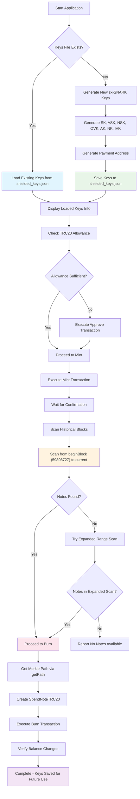

```mermaid
graph TD
    A[Start Application] --> B{Keys File Exists?}
    B -->|Yes| C[Load Existing Keys from shielded_keys.json]
    B -->|No| D[Generate New zk-SNARK Keys]
    
    C --> E[Display Loaded Keys Info]
    D --> F[Generate SK, ASK, NSK, OVK, AK, NK, IVK]
    F --> G[Generate Payment Address]
    G --> H[Save Keys to shielded_keys.json]
    H --> E
    
    E --> I[Check TRC20 Allowance]
    I --> J{Allowance Sufficient?}
    J -->|No| K[Execute Approve Transaction]
    J -->|Yes| L[Proceed to Mint]
    K --> L
    
    L --> M[Execute Mint Transaction]
    M --> N[Wait for Confirmation]
    N --> O[Scan Historical Blocks]
    O --> P["Scan from beginBlock (59808727) to current"]
    
    P --> Q{Notes Found?}
    Q -->|No| R[Try Expanded Range Scan]
    Q -->|Yes| S[Proceed to Burn]
    R --> T{Notes in Expanded Scan?}
    T -->|No| U[Report No Notes Available]
    T -->|Yes| S
    
    S --> V[Get Merkle Path via getPath]
    V --> W[Create SpendNoteTRC20]
    W --> X[Execute Burn Transaction]
    X --> Y[Verify Balance Changes]
    Y --> Z[Complete - Keys Saved for Future Use]
    
    style C fill:#e1f5fe
    style H fill:#e8f5e8
    style P fill:#fff3e0
    style S fill:#fce4ec
    style Z fill:#f3e5f5
```